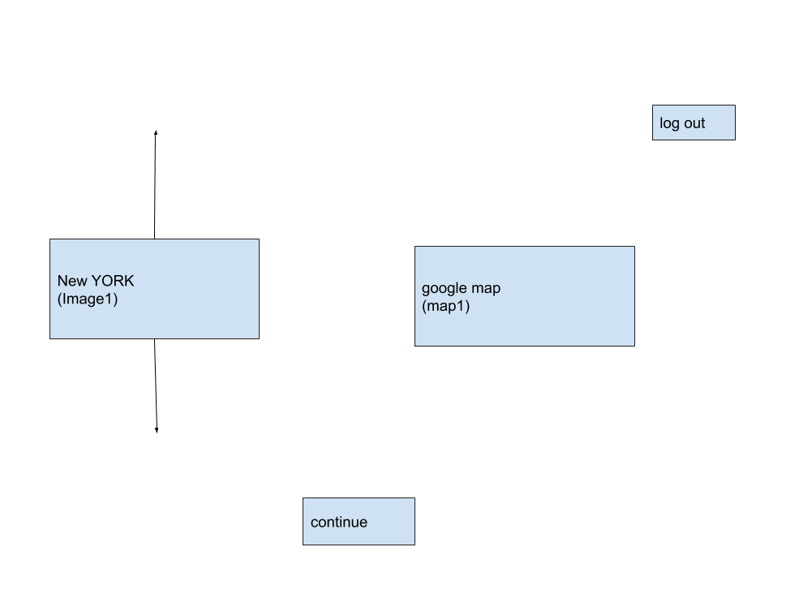

# Travel Plan Pegasus 
This is a design document for laioffer FLAG camp.<br\>
Contributor: Jie Ma

*This document follow the UC Berkeley CS 162 design document guide line*
[Documentation guideline] 
(https://people.eecs.berkeley.edu/~kubitron/courses/cs162-F06/design.html) 

### Part 0. Overview 
*Objective*
- This website provides 15 alpha cities travel plans.
- Users can create one city to make a day by day travel plans upto 15 days. 
- Users can select interest points for each city for different categories. 
- Users can order, delect the selected interest points. The website can generate travel plans by day based on the order of the selection. 
- The website can also autogenerate travel plans by day based on the selection set. 

*note*
All the bolded words refers one location on the website. 

*Definition of key words*
- interest points(景点): all the provided points regradless of the categories. 
- liked points:all the points user selected regardless of the categories.
- function: describe the function of the button/icon
- vistor: anyone visit the website without an account. 

### Part 1. Home Page 
Display as the diagram shows:

the Home Page serves three purposes: 
1. Allow visitor to select a city from the search bar and the website will jump to the login page 
2. Allow visitor to select a city from the image1, and the website will jump the login page 
3. Allow user who want to sign up to create an account. 
4. Allow users who have already signed up to log on. 

*TODO list the function, UI design ..... *
1. Search bar: 
2. image1:
3. Sign in: 
4. Sign up:
5. Sign out: 

### Part 2. Login/Logout Register 
1. Backend: 
2. Frontend:

### Part 3. Display interest points by category
Display as the diagram shows

Supported type: 
https://developers.google.com/places/supported_types 
1. Default popular spot

2. hotel 

3. shopping

4. restaurants

### Part 4. Select interest points (Jieyu's working on it) 

### Part 5. Generate routes based on user's selection 
- Purpose:
  Generate a visual route on GoogleMap according to liked points list.
- Function :
  Generate routes (user-defined)
- Scenario :
  1. Get ordered liked points from liked points list
  2. Use Google Map API (frontend) to pin liked points in order and draw a route on Google Map
  3. Send liked points list to backend for storing if invoking save route function 
  4. Update liked points list
	
### Part 6. Recommend routes based on user's selection 

## Milestones

