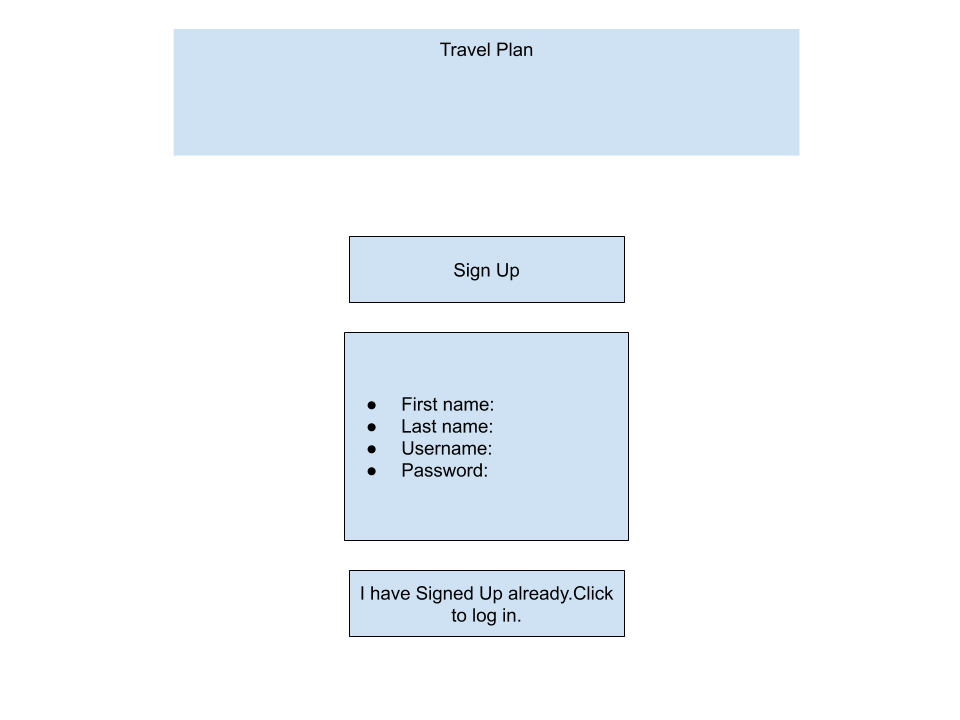
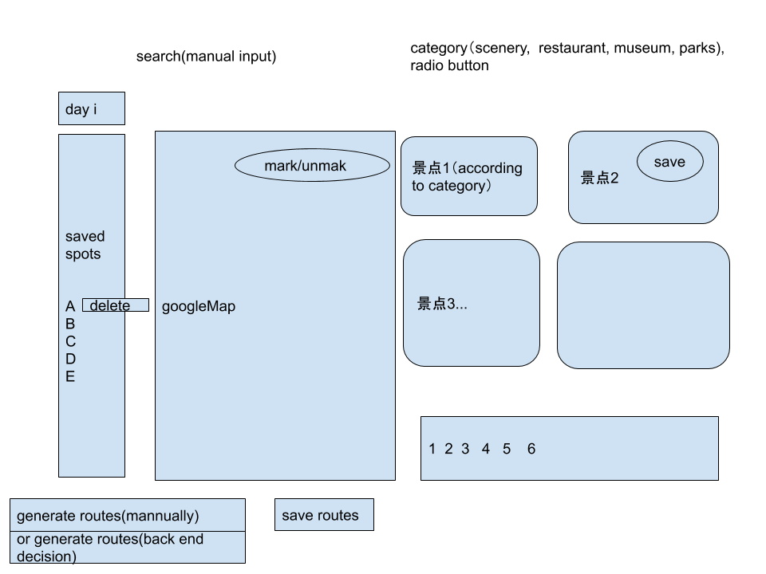

# Travel Plan Pegasus 
This is a design document for laioffer FLAG camp.
Contributor: Jie Ma

*Definition of key words*
- interest point(景点): all the provided spots regradless of the categories. 
- liked spots:all the points user selected regardless of the categories.
- function: describe the function of the button/icon
- visitor: anyone visit the website without an account. 

*This document follow the UC Berkeley CS 162 design document guide line*
[Documentation guideline] 
(https://people.eecs.berkeley.edu/~kubitron/courses/cs162-F06/design.html) 

JSON format for communication:

json for interest points should be consistent with googlemapAPI

json for register/login should be consistent with Jupiter

### Part 1. Overview 
*Objective*
- This website provides 15 alpha cities travel plans.
- Users can create one city to make a day by day travel plans upto 15 days. 
- Users can select interest points for each city for different categories. 
- Users can order, delect the selected interest points. The website can generate travel plans by day based on the order of the selection. 
- The website can also autogenerate travel plans by day based on the selection set. 

*Definition of key words*
- interest points(景点): all the provided points regradless of the categories. 
- liked points:all the points user selected regardless of the categories.
- function: describe the function of the button/icon

### Part 2. Home Page （Jie Ma) 

1. Anyone who wants to use this website has to be login. 
2. User cannot view city pictures without login. 
3. User login uses username and password
4. The authentication uses session (same us Jupiter) 
5. Vistor can sign up in this page : First Name, Last Name, Username, and Password

After login in, user will see a page like the following. 

User can start make travel plan for a city by  click a picture of the city(stage 2 can use search function) . User will jump to the TravelPlannCity image 

### Part 3. Display interest points by category
Display as the diagram shows

Supported type: 
https://developers.google.com/places/supported_types 
1. Default popular spot

2. hotel 

3. shopping

4. restaurants

*Outstanding issues: (Fan Chi Liu)

When user search a spot, how should we handle with this spot?
- Use another floating page, or
- Display on top of current category and keep other spots, or
- Display on current category after flushing all spots, or
- Display on specific category, or
- ...

### Part 4. Select spots (Jieyu You)
Each spot has a "save" button. On clicking the "save" button, the spot will be added to the "saved spots" list. This list contains the travel plan for one day, the user needs to use the drop-down list to switch to another day. Each entry in the "saved spots" list should contain a "delete" button to remove it from the list. *One entry must be selected as the starting point for the travel.*

requirements:

1. The "save spots" list for different day should be independent.
2. The order of spots in "saved spots" list should be the order of their addition.
3. A spot appear multiple times even on one day's list.
4. The list is saved only when "save routes" button is clicked.
  - if "generate routes(manually)" is selected, spots will be saved in the order of addition
  - if "generate routes(recommended)" is selected, spots will be saved according to the recommended order.
5. save routes only save the route of the current day.

### Part 5. Generate routes based on user's selection (Fan Chi Liu) 
- Purpose:
  Generate a visual route on GoogleMap according to liked points list.
- Function :
  Generate routes (user-defined)
- Scenario :
  1. Get ordered liked points from liked points list
  2. Use Google Map API (frontend) to pin liked points in order and draw a route on Google Map
  3. Send liked points list to backend for storing if invoking save route function 
  4. Update liked points list
	
### Part 6. Recommend routes based on user's selection (Jiahui Yang)
- Basic Version:
  show a shortest / random path of user's selection, connected with straight line.
  Input is an Array of JSON object (assign the start point) and commuting tools, backend extract the lat, lon of each point and use Distance Matrix API to get every two points distance, find the shortest distance among these locations.
  Output is one JSON object, a field 'rows' value is a JSON array, every row is from the same origial point to different destinations.
- Advanced Version:  
  generate the route by several features:
  1. traffic: avoid traffic for some route (Distance Matrix API has 'avoid' parameter)
  2. time and seasonal visiting frequency
  3. category: do not put the same category in the same day
  4. add more similarly recommended visiting places into the route.
  5. more features to be continued ...

### Part 6. Save routes (Luchen Liu)
After deside which route to pick (user-selection one or recommended one), by clicking on "save routes" button, the picked route will be saved to database (which is also the one that is rendering on the Map) and shuffle the left-hand-side list by using the selected order.

requirements:
1. the route list won't be saved until the "save route" button is clicked.
2. therefore, the firt step should be get the route which is rendering on the Map and save it to database when the button is OnClick.
3. second thing this button trigured is to change the order in the list. Here exist two conditions: 
   - if the user choose to adapt his own route, then the list won't change, it keeps the order as the user input it.
   - if the user choose to adapt the recommanded route, then the list will change order according to the recommandation route.

## Milestones
phase 1: finish an available webapp demo

6.16-6.23   
6.24-6.30  

phase 2: advanced features like recommendation based on interests, frontend components

7.1-7.8    
7.9-7.15   

7.24: delete(user_id, ith_day): delete ith day for user, move all days > i forward by 1
save Plan = fetch * n

## responsibilities:

back end:
Lin Lingzhi, Yang Yi, Jiahui Yang

front end(others):
https://docs.google.com/presentation/d/1UDRo6CPn3_8RZ0SdCnYxCgmBj_74D6t-nGSucmTrnxk/edit#slide=id.g59928f68e9_0_873
